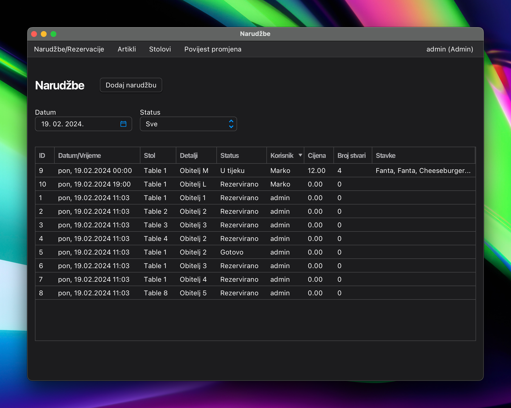
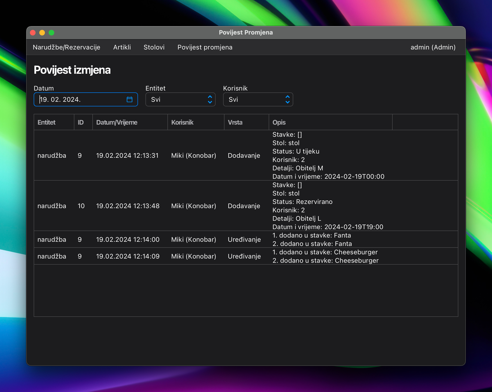
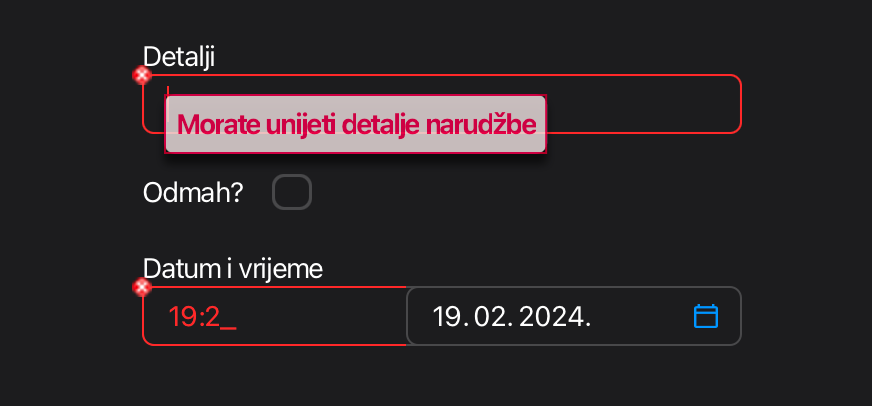

# TVZ Java Projektni zadatak

 
<i>Order screen</i>

## Description

Project for Java course at TVZ. Simple JavaFx application for managing restaurant i.e. orders, products, employees,
tables, reservations.

## Features

- Add, update, delete products, employees, tables, reservations, orders
- Search, filter and view products, employees, tables, reservations, orders
- "Asynchronous" querying with custom `SignaledTaskThread`
- Entity changes tracking, fully automatic diffing using reflection and custom annotations for specifying which fields to track and how to name them
  
- AtlantaFx for styling
- MariaDB for database
- Input fields validation with `ValidatorFx` and a few custom validation helpers
  
- Authentication and authorization
- Few JavaFx tweaks
  - Custom `TableView` with automatic resizing and scroll restoration
  - Searchable `ComboBox`
